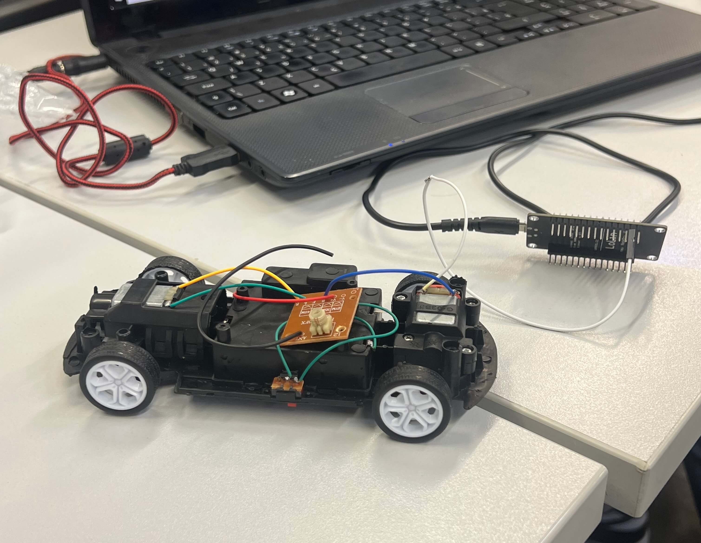
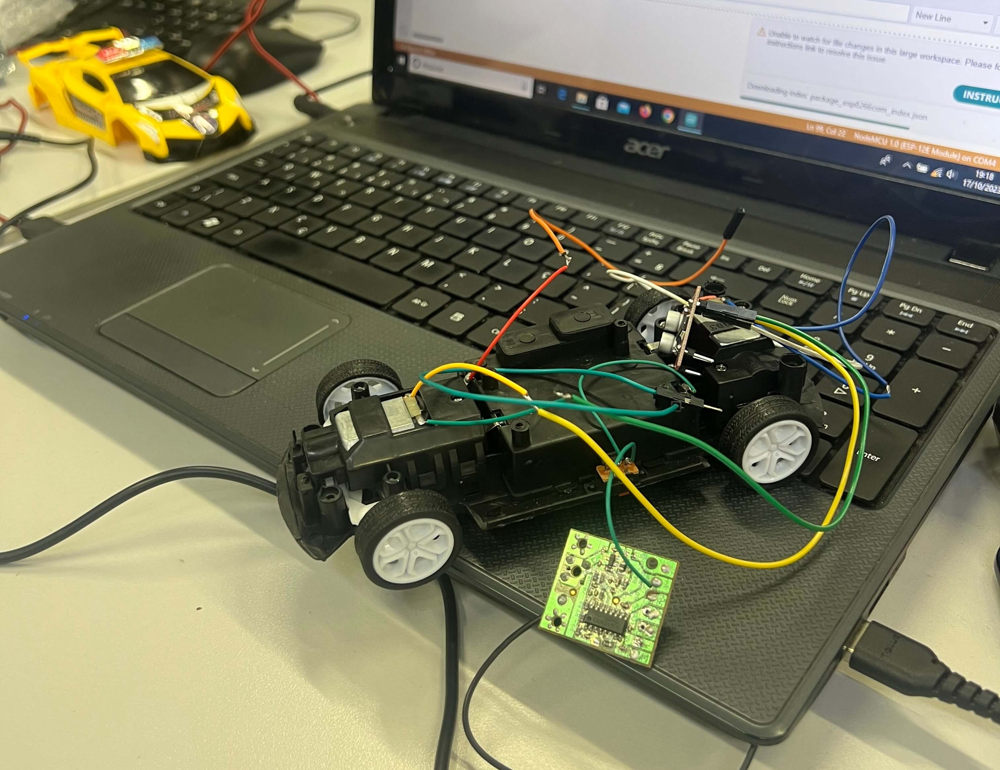
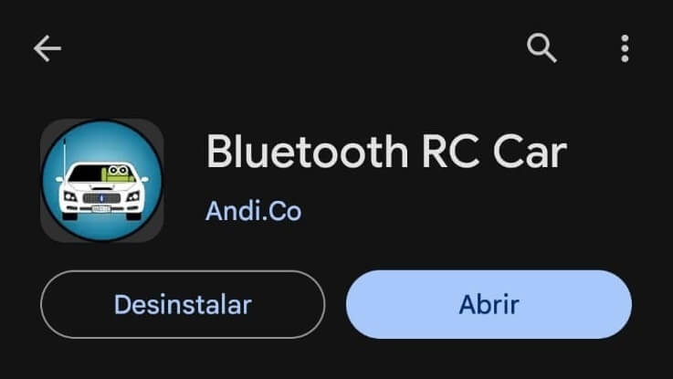
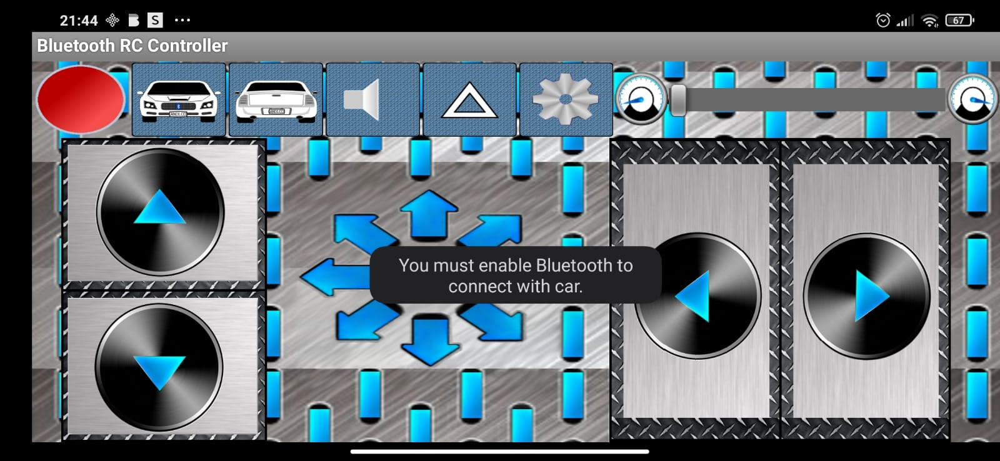

# IT-BRAZIL-ACADEMY-ADS-SALTO-GRUPO

## Nomes do participantes 👇

| Nome            | Função             | RGM            | 
|-----------------|--------------------|----------------|
| Fabíola Simionato Dos Santos | Desenvolvedor | 35735384 |
| Felipe Pampolin Miessi Luchini | Desenvolvedor | 35642009 |
| Fernada Oliveira Da Rocha | Desenvolvedor | 35233885 |
| Gustavo Oliveira Viana | Focal, Lider Dev | 35741406 |
| Isabela Feitosa Scalet | Desenvolvedora | 35984961 |

<!-- imagem para mostrar a base do projeto  -->

### Esse [video](https://www.youtube.com/watch?v=WWSqJVakfVY) que usamos de inpiração para o projeto

### O que seria o nosso projeto❓  

#### Controle remoto de carrinho via Esp32 com interface web em C++

Resumo: O projeto em questão é uma implementação de um sistema de controle remoto de um carrinho, no qual um ESP32 atua como ponte de comunicação, permitindo o controle do carrinho através de uma página da web. A página da web foi desenvolvida em HTML, CSS e C++, linguagem responsável por enviar comandos para o servidor web criado pelo ESP32. Um protótipo de controle remoto na forma de uma interface web é utilizado para interagir com o carrinho, onde cada botão emitido na página web envia comandos específicos, possibilitando o controle completo do movimento do carrinho.

1. Hardware Utilizado:

   - ESP32: O ESP32 é um microcontrolador Wi-Fi e Bluetooth amplamente utilizado na Internet das Coisas (IoT). Ele atua como a principal unidade de controle e comunicação neste projeto.
   
   - Carrinho de Controle Remoto: O carrinho é equipado com motores controlados por um sistema de ponte H, que permite controlar a direção e a velocidade das rodas.

2. Desenvolvimento da Interface Web :

   - Uma página da web foi programada para atuar como o painel de controle do carrinho. Esta página é hospedada no ESP32, que age como um servidor web.

   - A página da web possui botões que representam diferentes comandos, como: avançar, retroceder, virar à esquerda, virar à direita e parar.

   - Quando um botão é pressionado na página da web, um comando específico é enviado para o servidor web do ESP32.

3. Servidor Web ESP32:

   - O ESP32 está configurado como um servidor web para receber os comandos da página da web. Ele usa a biblioteca WiFiServer para atender às solicitações da página e interpretar os comandos recebidos.

   - O ESP32 traduz os comandos da página da web em ações físicas para controlar o carrinho. Por exemplo, ao receber um comando "avançar", ele aciona os motores do carrinho para se mover para frente.

4. Controle do Carrinho:

   - O carrinho é equipado com sensores e motores que permitem que ele execute as ações desejadas com base nos comandos recebidos do ESP32.

5. Resultados Esperados:

   - O resultado final do projeto é um sistema de controle remoto eficiente e responsivo que permite aos usuários controlar um carrinho de forma remota por meio de uma interface web amigável.

   - Os comandos são transmitidos sem fio via Wi-Fi, permitindo um controle preciso do movimento do carrinho em tempo real.

Conclusão: Este projeto combina hardware e software para criar uma solução de controle remoto de carrinho versátil e interativa. A página da web em HTML, atua como um controle remoto virtual, permitindo aos usuários controlar o carrinho de forma intuitiva. A integração do ESP32 como uma ponte de comunicação e servidor web torna possível a comunicação eficaz entre a interface web e o carrinho, resultando em um projeto prático e de grande potencial para aplicações de controle remoto e robótica.

### Para fazer. O que preciso?
<ul>
<h4>1- No celular</h4>
   <ul>
      <li>
Para que possa controlar o nosso carrinho basta tem baixado o software <a href="https://play.google.com/store/apps/details?id=braulio.calle.bluetoothRCcontroller">abaixo</a>
</li>
   </ul>
   <h4>Prints da tela do celular </h4>
</ul>

### Lista de material📖
- Placa esp8266 (NodeMCU)
- Carrinho de controle remoto 
- Celular (nenhuma marca específica) 
- Mini Ponte H L298N
- Buzzer Ativo
- LEDS 
- Resistores (220 Ohms para Cada LED)
- Jumpers

