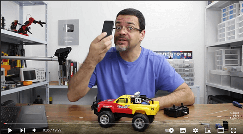

# IT-BRAZIL-ACADEMY-ADS-SALTO-GRUPO

## Nomes do participantes 👇

| Nome            | Função             | RGM            | 
|-----------------|--------------------|----------------|
| Fabíola Simionato Dos Santos | Desenvolvedor | 35735384 |
| Felipe Pampolin Miessi Luchini | Desenvolvedor | 35642009 |
| Fernada Oliveira Da Rocha | Desenvolvedor | 35233885 |
| Gustavo Oliveira Viana | Focal, Lider Dev | 35741406 |
| Isabela Feitosa Scalet | Desenvolvedora | 35984961 |

<!-- imagem para mostrar a base do projeto  -->

### Esse [video](https://www.youtube.com/watch?v=WWSqJVakfVY) que usamos de inpiração para o projeto 

### O que seria o nosso projeto❓  

Basicamente um carrinho de controle remoto, só que ao invés de usar o controle remoto, estamos utilizando um celular que conectamos via bluetooth
<!--(Descrição chique)-->
### Pré Requisitos do projeto 

### Lista de material📖
- Placa esp32 (modelo)
- Carrinho de controle remoto 
- Celular (nenhuma marca específica)
- Placa de PCB Ilhada 
- Mini Ponte H L298N
- Buzzer Ativo
- LEDS e Resistores (220 Ohms para Cada LED + 1 de 3.3KOhms + 1 de 5.6K Ohms)
- Jumpers

<!-- ### Valor dos materiais 

- Placa esp32 (modelo) R$34.00 - R$50.00
- Carrinho de controle remoto R$25 - R$55.00
- Celular (nenhuma marca específica) - já tinhamos 
- Placa de PCB Ilhada R$7.00 - R$15.00
- Mini Ponte H L298N R$7.00 - R$15.00
- Buzzer Ativo R$1.50 - R$7.00
- LEDS e Resistores (220 Ohms para Cada LED + 1 de 3.3KOhms + 1 de 5.6K Ohms) LEDs ~R$15.00 pct com 5 / resistor pct com 10 ~R$2.00
- Jumpers ~R$20.00 - 40 fios -->
